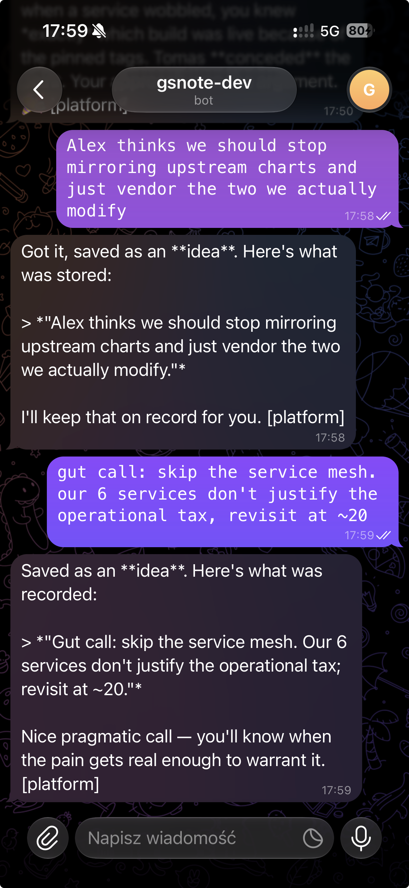
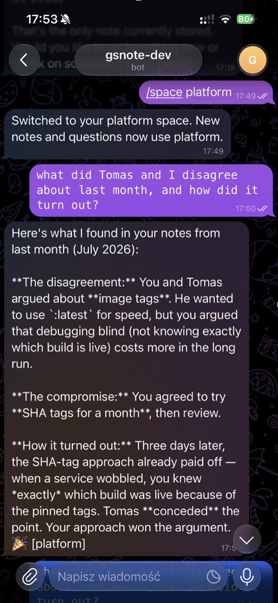

# gsnote

[](https://github.com/gscode1/gsnote/actions/workflows/test.yml)

A personal memory bot you chat with — Telegram or Slack today, other channels pluggable via the `Channel` adapter interface. Send notes, ask questions later, get a weekly nudge so nothing is forgotten.

Self-hosted · single-user · your own LLM key · Apache-2.0

## See it in action

<table>
  <tr>
    <td align="center"></td>
    <td align="center"></td>
  </tr>
  <tr>
    <td align="center"><b>Save anything, zero structure needed</b></td>
    <td align="center"><b>Ask later — it remembers, with dates</b></td>
  </tr>
</table>

## How the memory works

Not a dumb note pile — every note is indexed four ways in local SQLite, and a hybrid engine fuses them when you ask:

- **Vector search** — each note is embedded (`bge-large-en`, runs locally, no API calls) and stored in a [sqlite-vec](https://github.com/asg017/sqlite-vec) index, so "that show Marco mentioned" finds "The Bear" even with zero shared words.
- **Keyword search** — SQLite FTS5 with BM25 ranking, for the exact-string cases (names, error messages, commands).
- **Knowledge graph** — notes link to each other automatically: temporal edges connect notes captured close in time, semantic edges connect notes with similar embeddings. One memory pulls up its neighborhood.
- **Recency + intent-aware fusion** — a cheap intent detector classifies your question (`GENERAL` vs `WHEN`), then Reciprocal Rank Fusion combines all candidate lists with per-intent weights. Time questions lean on dates, topic questions lean on meaning. Note importance and past access stats nudge the final ranking.

Every answer cites when each note was saved, so "what did we decide last month?" gets a dated, verifiable answer — all from a single SQLite file you own and can export.

## What you need

1. A channel: a [Telegram bot token](https://t.me/BotFather) and your Telegram user id ([@userinfobot](https://t.me/userinfobot)) — or a Slack app (see Config below)
2. An LLM API key (OpenRouter, Anthropic, or any OpenAI-compatible provider)

---

## Setup

```bash
cp .env.example .env
```

Fill in at least:

```bash
LLM_API_KEY=...
TELEGRAM_BOT_TOKEN=...
TELEGRAM_ALLOWED_USER_IDS=123456789   # your numeric id; comma-separate for more
```

Then:

```bash
docker compose pull   # prebuilt multi-arch image from GHCR
docker compose up -d
```

### Verify it works

Open your bot in Telegram (or a DM in Slack, if `CHANNEL=slack`). You should see an exchange like:

> **You:** I told the landlord I'd fix the leaky tap by Friday
>
> **Bot:** Noted — saved that.
>
> **You:** what did I promise the landlord?
>
> **Bot:** You promised to fix the leaky tap by Friday.

If the bot answers your question from the note you just sent, everything is wired up. No reply? Check `docker compose logs -f` — the bot refuses to start with a clear error if a required variable is missing.

### Other ways to run (optional)

Build from source instead of pulling:

```bash
docker compose up --build
```

Without Docker:

```bash
python -m venv .venv && source .venv/bin/activate
pip install -e .
cp .env.example .env   # same required vars
uvicorn app.main:app --host 0.0.0.0 --port 8000
```

Kubernetes (Helm):

```bash
cp charts/gsnote/values.yaml my-secrets.yaml   # fill in image + secrets (gitignored)
helm install gsnote charts/gsnote -n gsnote --create-namespace -f my-secrets.yaml
```

Optional in-cluster whisper STT: set `whisper.enabled=true` and point `config.STT_BASE_URL` at `http://whisper:9000/v1`.

---

## How to use

| You send | What happens |
|---|---|
| A note or idea | Saved to your memory (classified + searchable) |
| A question | Searches your notes and answers from them |
| A voice note | Transcribed, then treated like text *(needs STT — see below)* |
| `/space <name>` | Switch to (or create) a named space |
| `/space` | Show active space and your spaces |
| Weekly digest buttons | Engaged / Dismiss / Snooze |

Spaces keep notes apart. You start in the `default` space; create your own with `/space <name>`. New notes and questions use the active space, and every reply ends with a `[space]` tag showing where it was saved or searched.

---

## Config

Minimum (required when `CHANNEL=telegram`):

| Variable | What it is |
|---|---|
| `LLM_API_KEY` | Your provider key |
| `LLM_PROVIDER` | `openrouter` (default), `anthropic`, or any OpenAI-compatible name |
| `TELEGRAM_BOT_TOKEN` | From BotFather |
| `TELEGRAM_ALLOWED_USER_IDS` | Your Telegram id(s) — empty = bot refuses to start |

For `CHANNEL=slack` instead: `SLACK_BOT_TOKEN` (xoxb-), `SLACK_APP_TOKEN` (xapp-, Socket Mode), `SLACK_ALLOWED_USER_IDS` (your Slack user id, U...). Slack app setup: Socket Mode on, bot scopes `chat:write` + `im:history` + `commands` (+ `files:read` for voice), subscribe to `message.im`, and create a `/space` slash command (no request URL needed — Socket Mode delivers it).

Useful optional vars:

| Variable | Default | What it does |
|---|---|---|
| `API_TOKEN` | empty = HTTP data API off | Bearer token for `/capture`, `/search`, `/report`, `/export` (`Authorization: Bearer <token>`) |
| `CLASSIFIER_MODEL` / `ANSWER_MODEL` | cheap / strong | Models for tagging notes vs answering |
| `CHANNEL` | `telegram` | `telegram` (default), `slack`, or `none` (HTTP only) |
| `RESURFACING_CRON` | `0 9 * * MON` | Weekly digest schedule |
| `STT_ENABLED` / `STT_BASE_URL` | off | Voice notes via an OpenAI-compatible STT endpoint |

Full list: [`.env.example`](.env.example).

---

## CLI

`pip install -e .` also installs a `gsnote` command that talks to the HTTP API. Set `API_TOKEN` (required) and `GSNOTE_URL` (default `http://localhost:8000`):

```bash
gsnote health
gsnote add "I told the landlord I'd fix the tap by Friday" --space home
echo "from a pipe" | gsnote add
gsnote search "landlord" --top-k 5
gsnote report "what did I promise?"
gsnote export -o gsnote-export.json
```

Add `--json` to any command for the raw API response.

---

## Export

Your notes are yours. Download everything as JSON (needs `API_TOKEN`):

```bash
curl -H "Authorization: Bearer $API_TOKEN" http://localhost:8000/export -o gsnote-export.json
```

The file is `{"version": 1, "exported_at": ..., "notes": [...]}` — each note carries its content, category, source, space, timestamps, and access stats.

---

## Privacy

Notes live in local SQLite. When the bot reasons, content goes to **your** LLM provider. You pick the key and endpoint.

---

## Backup (optional)

Off by default. Set `LITESTREAM_ENABLED=true` plus S3 vars in `.env`, then restart. Restore runs on container start when Litestream is on and no local DB exists.

---

## Develop

```bash
pip install -e ".[dev]"
pytest
```

Contributing a channel or fix? See [`CONTRIBUTING.md`](CONTRIBUTING.md). Security issues: [`SECURITY.md`](SECURITY.md).

---

## License

Apache-2.0 — see [`LICENSE`](LICENSE).
